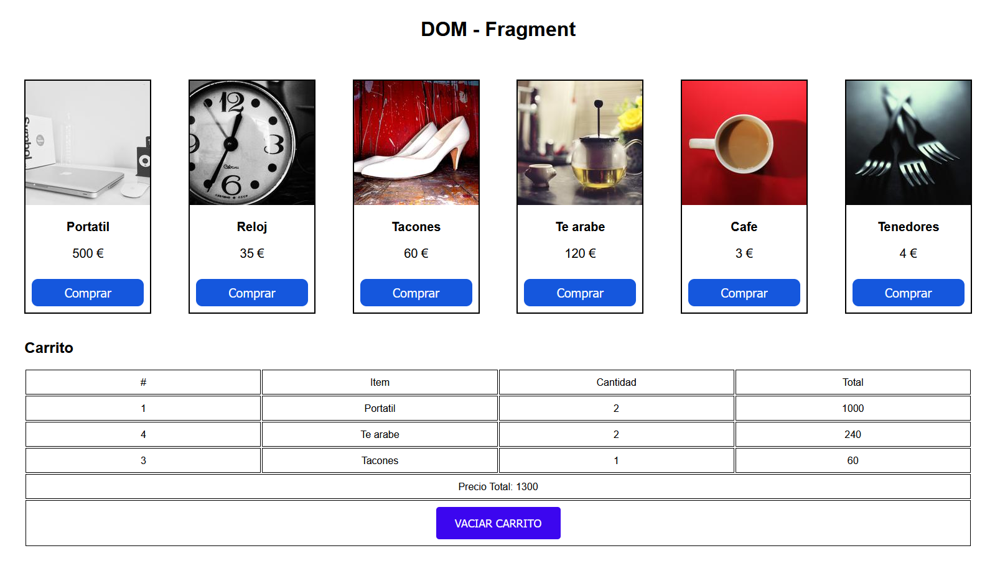

# Carrito

This is a js project based on buying items, which will be added to the shopping cart.

## Table of contents

- [Description](#description)
- [Technologies](#technologies)
- [Installation](#installation)

## Description

This is a js project based on buying items, which will be added to the shopping cart. Every time we buy an item, it will be added to the cart, updating the total purchase price.

Keep in mind that for the items to be saved in the shopping cart, we need local storage to store the information and for data persistence to work correctly.

## Technologies

The project has been created with:

- HTML
- CSS
- JS

## Installation

To run this project, we need the following steps:

- Disable the option to delete cookies and data from the site when the browser is closed, so that the information is displayed in the application correctly. This option will be found in your browser settings.

- Download and install vscode at the following link: https://code.visualstudio.com/download

- Download the Live Server extension, which is found in the vscode editor

- Once the extension is downloaded, run the extension and everything will work correctly
